<!-- 
╔══════════════════════════════════════════════════════════════════════════════╗
║                                                                              ║
║   ███████╗██╗███╗   ██╗ █████╗     ██████╗  █████╗ ██╗  ██╗███╗   ███╗       ║
║   ██╔════╝██║████╗  ██║██╔══██╗    ██╔══██╗██╔══██╗██║  ██║████╗ ████║       ║
║   ███████╗██║██╔██╗ ██║███████║    ██████╔╝███████║███████║██╔████╔██║       ║
║   ╚════██║██║██║╚██╗██║██╔══██║    ██╔══██╗██╔══██║██╔══██║██║╚██╔╝██║       ║
║   ███████║██║██║ ╚████║██║  ██║    ██║  ██║██║  ██║██║  ██║██║ ╚═╝ ██║       ║
║   ╚══════╝╚═╝╚═╝  ╚═══╝╚═╝  ╚═╝    ╚═╝  ╚═╝╚═╝  ╚═╝╚═╝  ╚═╝╚═╝     ╚═╝       ║
║                                                                              ║
║            🚀 FULL STACK WEB DEVELOPER • PROBLEM SOLVER • CREATOR 🚀         ║
║                                                                              ║
╚══════════════════════════════════════════════════════════════════════════════╝
-->

<div align="center">

  <!-- Dynamic Waving Header Banner -->
  

  <br/>

  <!-- ═════════════════════════════════════════════════════════════════════════ -->
  <!-- 📊 PROFILE BADGES                                                         -->
  <!-- ═════════════════════════════════════════════════════════════════════════ -->

  <a href="https://github.com/sinarahmany">
    
  </a>
  &nbsp;
  <a href="https://github.com/sinarahmany?tab=repositories">
    
  </a>
  &nbsp;
  <a href="https://github.com/sinarahmany?tab=followers">
    
  </a>
  &nbsp;
  <a href="https://github.com/sinarahmany">
    
  </a>

</div>

<br/>

<div align="center">
  
</div>

<br/>

<div align="center">
  
</div>

<br/>

<!-- ═══════════════════════════════════════════════════════════════════════════ -->
<!-- 👤 ABOUT ME SECTION                                                         -->
<!-- ═══════════════════════════════════════════════════════════════════════════ -->

## 👤 About Me

<table>
<tr>
<td width="55%" valign="top">

### 🎯 Who I Am

```yaml
name: Sina Rahmannejad
role: Full Stack Web Developer
located_in: Vancouver, Canada 🇨🇦
portfolio: sinarahmannejad.com
email: info@sinarahmannejad.com

core_specialties:
  - 🌐 Frontend Architecture (Vue / React / Next / Nuxt)
  - ⚙️ Backend & API Development (PHP / Laravel / Node)
  - 🗄️ Relational Database Engineering (MySQL)
  - 🎨 Modern UI & Responsive Styling (TailwindCSS / Bootstrap)

passions:
  - Building performant & accessible web applications
  - Clean, modular, and maintainable architecture
  - Continuous exploration of modern web technologies
